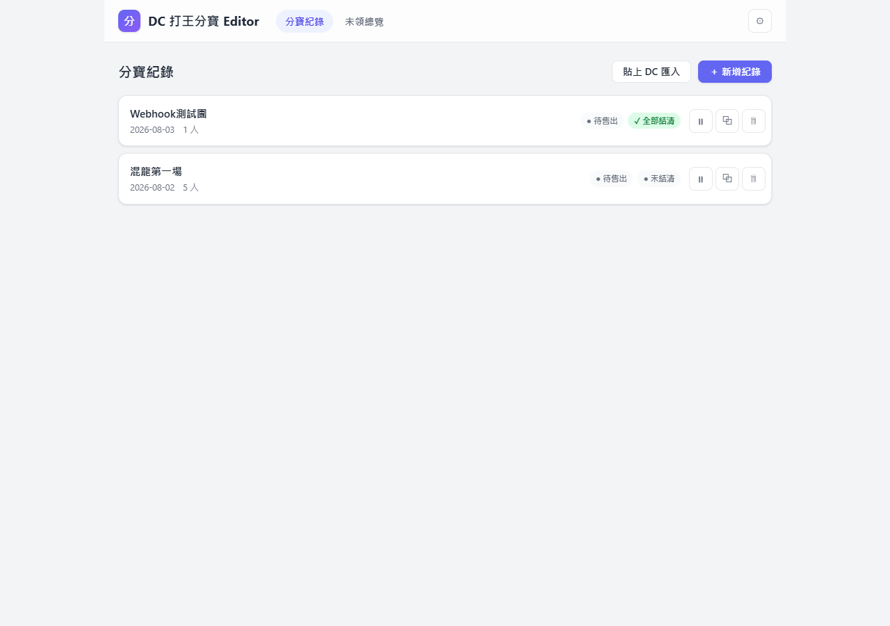
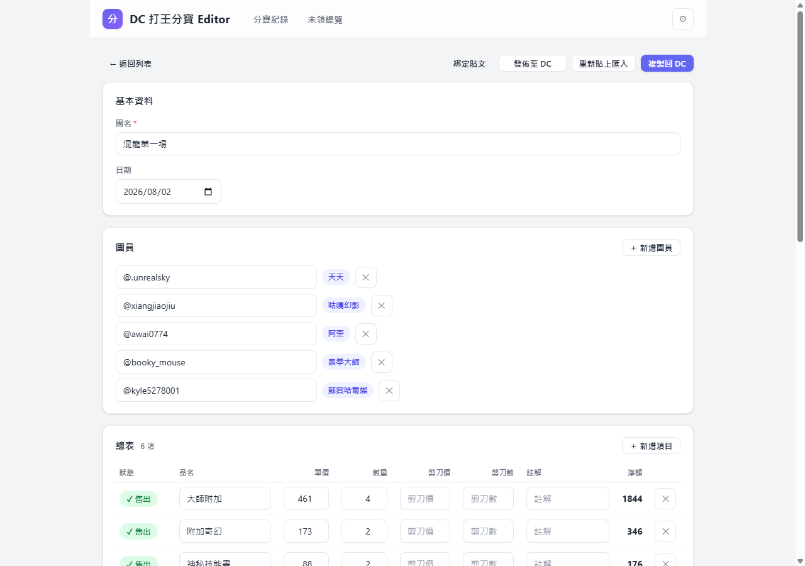
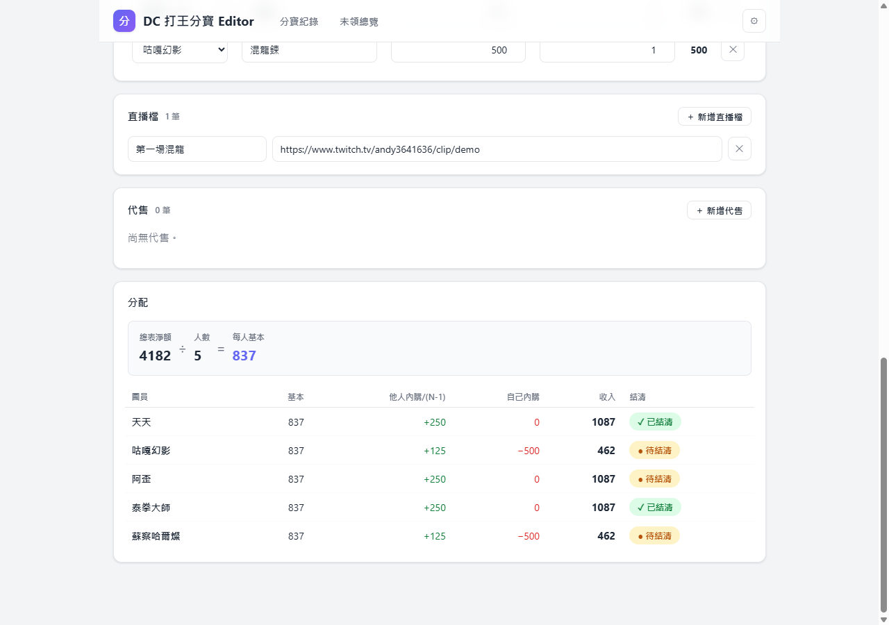
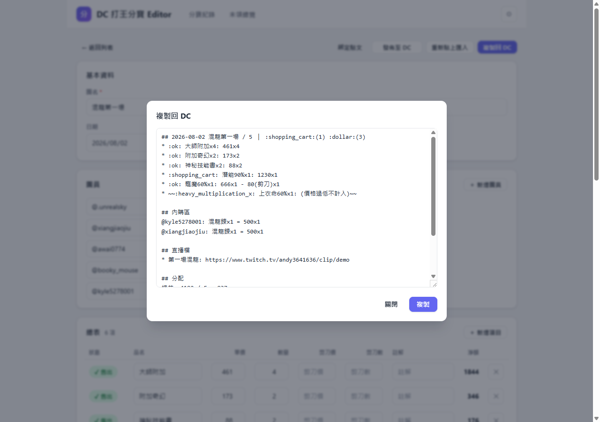
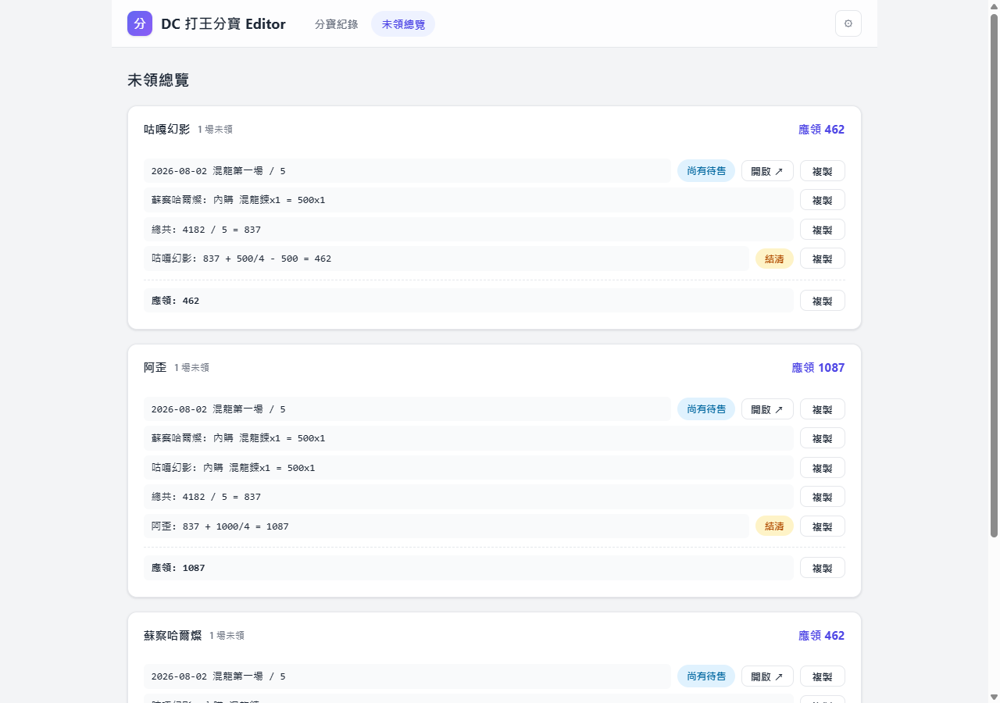
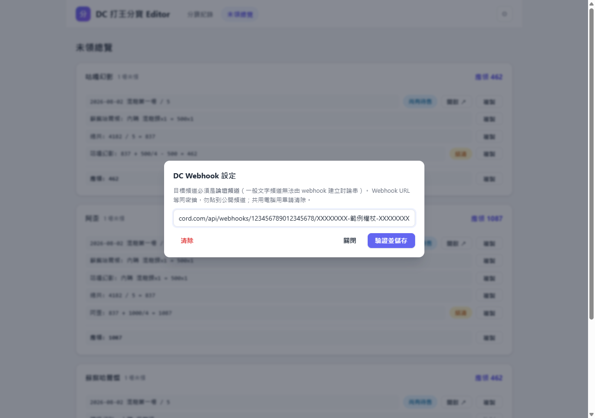

# DC 打王分寶 Editor

給團長用的打王分寶記帳工具：把 Discord 上的分寶紀錄貼進來、用表單快速編輯、
自動算好每個人該拿多少錢，再一鍵複製回 Discord 或直接發佈到論壇頻道。

**網址：<https://unrealsky.github.io/dc-loot-editor/>**

> ⚠️ 所有紀錄都存在「你這台電腦的這個瀏覽器」裡（不會上傳到任何伺服器）。
> 換電腦、換瀏覽器或清除瀏覽資料，紀錄就不見了——重要紀錄請先發佈到 DC 留底。

---

## 分寶紀錄列表



開站看到的第一頁，每筆紀錄一張卡片：

- **＋ 新增紀錄**：從空白開始建一筆。
- **貼上 DC 匯入**：把 Discord 上既有的分寶內容整段複製貼上，自動解析成表單。
- 卡片右側兩個狀態徽章：**待售出／✓ 全數賣出**、**未結清／✓ 全部結清**，一眼看出哪團還沒收尾。
- **⏸（擱置）**：這團暫時不想列入統計（例如東西還在慢慢賣）就按它，會出現「⏸ 擱置中」黃色徽章；再按一次取消。
- **⧉ 複製**、**🗑 刪除**：複製整筆紀錄／刪除（會先確認）。

## 編輯紀錄



- **團名**（必填）與**日期**（預設當天）。
- **團員**：輸入 DC 帳號（如 `@awai0774`），有建名冊別名的會自動顯示中文別名徽章。人數不用填，加幾個人就是幾人。
- **總表**：打到的東西一列一項。
  - 最左邊的**狀態**按一下會循環切換：`🛒 待售 → ✓ 售出 → ✖ 不計入`（不計入會自動加上「(價格過低不計入)」註解）。
  - 填**單價、數量**；要消耗剪刀才能交易的東西，再填**剪刀價、剪刀數**（剪刀成本會從該項淨額扣掉）。
  - 品名輸入框會模糊搜尋建議（打「大附」也找得到「大師附加」）；滑鼠停在單價框上會提示歷史成交價。
  - 金額還沒填的項目，輸出時會顯示 `?` 而不是 0。
- **內購區**：團員自己買走的東西（付錢給其他團員均分），買家只能選團員。
- **直播檔**：貼直播/剪輯連結。
- **代售**：部分物品交給其他團員賣的情況，填誰代售、賣多少；金額會直接在結算時扣抵，避免金幣轉手被遊戲收兩次手續費。

## 分配名單



全自動計算，不用按任何按鈕：

```
個人收入 = 總表淨額 ÷ 人數 ＋ 其他人內購 ÷ (人數−1) − 自己內購 − 自己代售持有額
```

金額一律無條件進位。每列右側的**結清**標籤點一下就切換「已結清／未結清」，
在遊戲裡把錢交給誰之後就點誰。

## 複製回 DC



右上角「**複製回 DC**」會產生排好格式的文字，一鍵複製後直接貼回 Discord。
表情符號輸出一律用短碼（`:ok:` 這種寫法），貼到 DC 會自動變成表情。
反過來，DC 上的內容（不管表情是短碼還是圖案）也都能用「貼上 DC 匯入」吃回來。

## 未領總覽



上方導覽切到「**未領總覽**」，一頁看完**誰還沒領到什麼錢**：

- 每個還有未結清款項的團員一個區塊，跨團場次自動加總（最後一行「應領」）。
- 每一行右側都有**複製**按鈕——遊戲內信件不能貼多行，就一行一行複製貼給對方。
- **結清**：在遊戲裡付完錢，直接在這頁點結清，該場立刻從區塊消失。
- **開啟 ↗**：另開分頁直達該紀錄的分配名單（兩個分頁的資料會即時互通）。
- 標「**尚有待售**」的場次代表金額可能還會變；被**擱置**的紀錄不會出現在這頁。

## 發佈到 Discord 論壇（Webhook）

不想手動複製貼上的話，可以讓工具直接把紀錄發佈成 DC 論壇貼文，之後內容有更新按一下就同步。

### 第一次設定（只做一次）

1. 在 DC 伺服器建立一個**論壇頻道**（一定要論壇，一般文字頻道做不到）。
2. 若頻道有開「發文必須選擇標籤」，先關掉。
3. 頻道設定 → 整合 → Webhook → 新增 Webhook，複製它的 URL。
4. 回到工具，點右上角 **⚙**，貼上 URL 按「驗證並儲存」，看到綠色 ✓ 就完成了。



> 🔑 這條 URL 等於發文鑰匙，拿到的人都能用它冒名發訊息——不要貼到公開頻道。
> 共用電腦用完請按「清除」。

### 發佈與同步

- 編輯頁的「**發佈至 DC**」：建立論壇貼文，標題是 `[08-02]混龍第一場` 這種格式。
- 發佈過的紀錄按鈕變成「**同步至 DC**」：內容改了（賣掉東西、有人結清）再按一下，DC 上的貼文就更新。按鈕會顯示轉圈（執行中）、綠色 ✓（成功）、紅色 ✕（失敗，下方會寫原因）。
- 貼文內文第一行的標題會帶即時狀態：🛒(2) = 還有 2 項待售、💵(3) = 還有 3 人未領錢、☑️ = 全結案。

### 幾個限制（Discord 的規則，不是工具的問題）

- 討論串**標題**建立後就固定了，之後只有內文會更新（你可以在 DC 手動改標題，不影響同步）。
- 內文最多 2000 字元，超過會擋下來提醒你精簡。
- 換電腦或清了瀏覽資料後，用編輯頁的「**綁定貼文**」貼上該貼文的訊息連結（DC 右鍵訊息 → 複製訊息連結），就能把貼文接回來繼續同步。

## 團員名冊與品名清單

團員的**中文別名**（輸入 DC 帳號自動顯示「天天」這種名字）和品名輸入框的**建議清單**，
是所有使用者共用的資料，由管理員統一維護：

- 別名顯示錯誤、想改別名、或常用品名沒出現在建議裡 → 跟管理員（團長）說一聲。
- 管理員更新後，你**重新整理網頁**就會拿到最新資料，不用做任何設定。

> 給管理員：這兩份資料是 repo 裡的 [`members.json`](members.json) 與
> [`items.json`](items.json)，在 GitHub 網頁上直接編輯提交即可，不需要重新發版。
